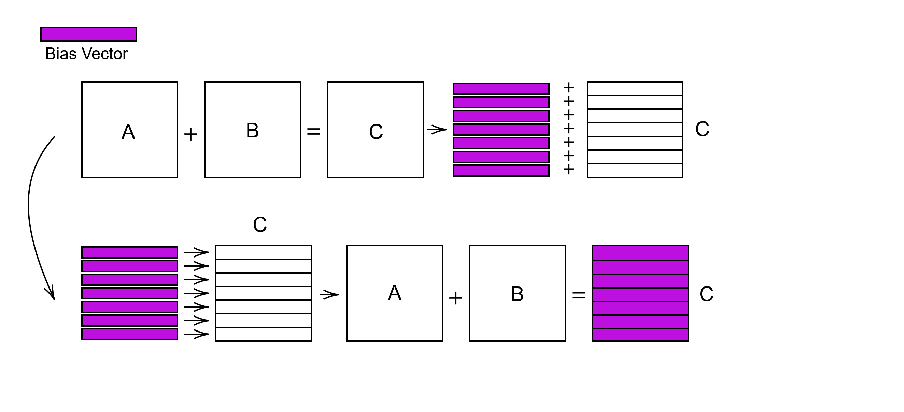
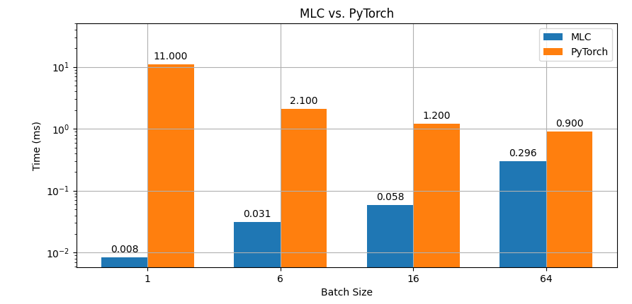

Individual Phase
=======================================

Overview
--------

Machine learning is a rapidly growing field of computer science. Neural networks are used extensively in many modern applications. Crucial to their success is not only the accuracy of the models but also the speed at which they can perform predictions. While fast training is desirable, real-time prediction is essential for tasks such as self-driving cars, medical imaging, security systems, and more.

Popular frameworks like TensorFlow and PyTorch enable developers to build and maintain large networks easily with minimal boilerplate code. However, these libraries sometimes lack hardware-specific optimizations, particularly when it comes to real-time inference, leaving room for potential performance improvements.

This is why we have chosen to use our custom tensor contraction library, specifically our optimized einsum implementation, to evaluate whether our hardware-accelerated tensor multiplications can outperform PyTorch’s forward pass in prediction tasks.

Since prediction time is more critical than training time in most real-world applications, we will first train a model using PyTorch's robust tools. We will then benchmark the inference performance between PyTorch and our implementation. This involves implementing the necessary components to load a pre-trained PyTorch model, process a dataset, perform the forward pass and output the predictions in a human-readable format.

Feature Outline
----------------

- Dataset generation and model training
- Inference benchmarking
- Visualization of results
- Validation using a C++ implementation

Run the full workflow with:

.. code-block:: bash

    python main.py

Folder Structure
----------------

.. code-block:: text

    python/
    ├── components/
    │   ├── __init__.py
    │   ├── plot.py              # Contains PlotResults class
    │   ├── run_inference.py     # Contains Inference class
    │   └── setup.py             # Contains Setup class
    ├── data/
    │   ├── example.csv
    │   ├── inference_times.csv
    │   ├── iris.csv
    │   ├── model_state_dict.pt
    │   └── model.torchpp
    ├── main.py                  # Entrypoint to run the pipeline
    ├── modules/
    │   ├── __init__.py
    │   └── basic_net.py         # PyTorch model definition
    ├── requierments.txt
    └── tests/
        ├── __init__.py
        ├── sample.py            # Contains Tests class
    test/
    └── basic_net/
        └── correct_calculations.cpp  # C++ validator using Tensor class

Components
----------

**1. Setup (`components/setup.py`)**

- Loads the Iris dataset using `sklearn`.
- Saves it to `data/iris.csv`.
- Trains a PyTorch model defined in `modules/basic_net.py`.
- Saves the model in two formats:
    - `model_state_dict.pt`: PyTorch-native checkpoint
    - `model.torchpp`: Custom format for loading in C++ (Torch++)

**2. Inference (`components/run_inference.py`)**

- Loads the trained model.
- Runs inference `n` times using the full dataset with varying batch sizes `b`.
- Measures execution time and saves results to `data/inference_times.csv`.
    
    Parameters:
        - `n` ∈ {1, 10, 100, 1000, 10000}
        - `b` ∈ {1, 6, 16, 64}

**3. PlotResults (`components/plot.py`)**

- Loads `inference_times.csv`.
- Generates performance visualizations using `matplotlib`.

**4. Tests (`tests/sample.py`)**

- Generates a fixed input-output pair with `batch_size=4`.
- Exports it to `data/example.csv` for cross-platform validation.

C++ Validation 
-----------------------------------------------------------
(`test/basic_net/correct_calculations.cpp`)

- Implements a reference version of the model in pure C++.
- Uses `example.csv` to compare inference results against PyTorch.
- Relies on a custom `Tensor` class for matrix and tensor operations.

Dependencies
------------

Install Python dependencies using:

.. code-block:: bash

    pip install -r requierments.txt

Required packages:

- `torch`
- `scikit-learn`
- `pandas`
- `tqdm`
- `matplotlib`

Usage
-----

Run the full pipeline with:

.. code-block:: bash

    python main.py

This performs:

- Dataset generation and model training
- Inference benchmarking
- Plotting of inference timings
- Export of a sample batch for C++ validation

Features and Optimizations
--------------------------

First and Last Touch Primitives in Einsum Trees
^^^^^^^^^^^^^^^^^^^^^^^^^^^^^^^^^^^^^^^^^^^^^^^

In order to use activation functions like ReLU, we must be able to add markers for first and last touch primitives to each node. 
Thus, we continued our standard for describing the einsum tree by adding multiple characters, which each represent a different first/last touch primitive.
For example 'r' stands for ReLU and 'z' for zero. These characters must be positioned in such a way for them to be translated correctly. A first touch primitive has to be 
inside the brackets, of the respective tensor holding the tensor dimension IDs. For example, if we have a tensor with dimension IDs :code:`[0, 1, 3]`, the first 
touch primitive 'z' has to be placed as follows:

.. code-block:: text

    [0, 1, 3, z]

If we want to use a last touch primitive, it has to be placed after the brackets like this: 

.. code-block:: text

    [0, 1, 3]r

Bias Implementation
^^^^^^^^^^^^^^^^^^^

The bias of a neural network layer is a tensor that is added to the output of the layer. In our task, it is specifically a vector that has to be added to 
each row of each output matrix. Thus, our first basic implementation was to pass the bias vector into our recursive execution function of the einsum tree. An 
extra addition was performed after the execution of a contraction using the correctly marked bias vector. This implementation was simple but not very efficient, 
as it required an additional loop over the output matrix after each contraction. Therefore, we adopted an idea from a classmate, which was given to us after the 
final presentation. Our current implementation loads the respective bias vector into the output tensor of each contraction. This is achieved by filling each 
column with the corresponding bias value, since we work with column-major tensors. This way, we can avoid the further additions and load the bias directly 
("add") to our intermediate output tensors.

ReLU fusion
^^^^^^^^^^^

The ReLU activation function can be a bottleneck for our model performance, as it has to reload the values just computed into the registers and then take the max between 0 and the respective value.
Then the values have to be stored again.
To hide this memory bound operation, the last touch operation in the original implementation is made directly after the GEMM.
We have now taken this to the extreme and included the last touch in the last GEMM kernel.

.. code-block:: text

    ...
    fmla v21.4s, v25.4s, v30.s[0]
    fmla v22.4s, v26.4s, v30.s[0]
    fmla v23.4s, v27.4s, v30.s[0]
    fmla v24.4s, v28.4s, v30.s[0]

    cbnz x10, k_loop

    eor	v31.16b, v31.16b, v31.16b

    fmax v0.4s, v0.4s, v31.4s
    fmax v1.4s, v1.4s, v31.4s
    ...
    fmax v23.4s, v23.4s, v31.4s
    fmax v24.4s, v24.4s, v31.4s

    st1	{v0.4s-v3.4s}, [x9]
    add	x9, x9, x5
    st1	{v4.4s-v7.4s}, [x9]
    add	x9, x9, x5
    st1	{v8.4s-v11.4s}, [x9]
    add	x9, x9, x5
    ...
    
In the assembly code above you can see how directly after the last K loop the RELU function is fused and only then the data is saved.
This eliminates the need for a whole memory-bound read and write access.
As an overhead, we have to produce another BRGEMM kernel just-in-time. Which we call at the last access to the output data.

MLC vs PyTorch
^^^^^^^^^^^^^^

Now is the exciting time to see how our implementation compares to PyTorch.
First, we represented the model as an einsum tree:

.. code-block:: text

    [[[1,0],[2,1]->[2,0]r],[3,2]->[3,0]r],[4,3]->[4,0]

As you can see, ReLU activation functions are computed after the first two contractions, which can be easily identified by backend thanks to our extended einsum notation.
This is what the input in our machine learning compiler looks like:

.. code-block:: C++

    std::string str_repr = "[[[1,0],[2,1]->[2,0]r],[3,2]->[3,0]r],[4,3]->[4,0]";
    EinsumTree model_tree = EinsumTree(str_repr, {BATCH_SIZE, 4, 64, 16, 3}, true);

We then apply our optimizations to this tree at every level.
After that, we are ready to call the :code:`execute` function.
It only receives the model input, the weight matrices and biases from the trained PyTorch model as input and can thus perform fast inference.

As an example, here is a simple output from our `check_iris_model <https://github.com/stefan0re/machine_learning_compiler/blob/model_tests/benchmark/check_iris_model.cpp>`_ executable to ensure that the model calculates correctly.

.. code-block:: text

    Compare:    PyTorch /   C++   /    mlc 
    compare 0: -18.3955 / -18.3955 / -18.3955
    compare 1: -9.79693 / -9.79693 / -9.79693
    compare 2: 27.2584 / 27.2584 / 27.2584

That works and now it's time for hard numbers, let's see how our model performs against PyTorch with different batch sizes. :-)

In this plot you can see the execution speed of a forward pass through the network. For small batch sizes we are significantly faster than PyTorch.
The larger the batch size, the more the two times converge.
We also tested even larger batch sizes, which resulted in Pytorch being faster than our implementation from a batch size of 512.
However, the difference was never greater than one millisecond.

We all worked on the tasks in equal parts.