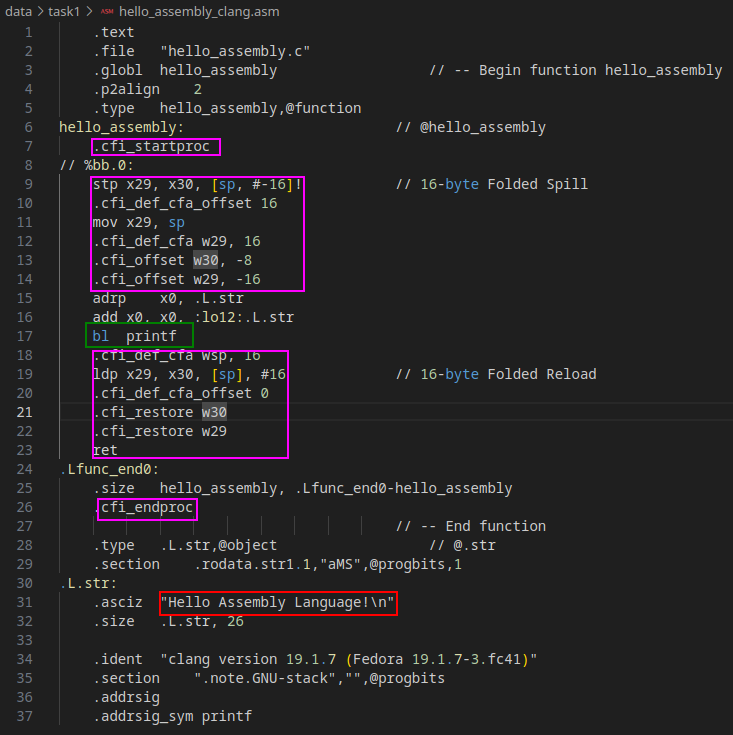
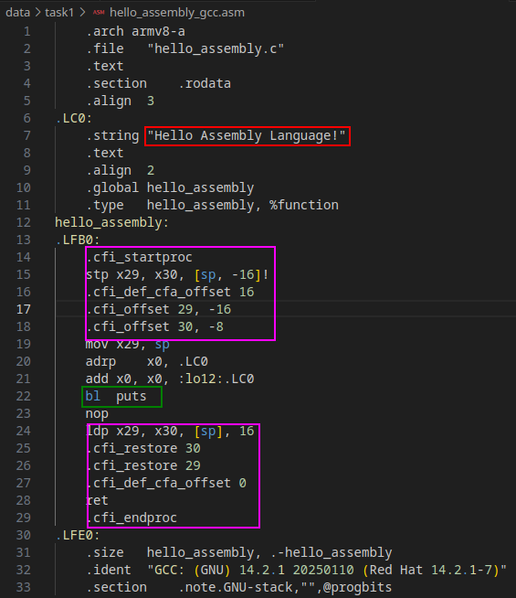

Introduction to Aarch64 Assembly
================================

In the first week we want to warm up with ARM Assembly and take a closer look at the generation of machine code.
The first task deals with the generation of assembly code and its analysis. 
In the second task, we look directly at ones and zeros, e.g. our assembled add_values function.

Task 1: Hello Assembly
----------------------

In this task, a C function was given in which only `Hello Assembly Language!` is printed to the standard output.

For this function we generated assembly code once with clang and once with gcc compiler.

.. code-block:: bash
    :linenos:

    gcc -S hello_assembly.c -o hello_assembly_gcc.asm
    clang -S hello_assembly.c -o hello_assembly_clang.asm

In the resulting assembly code, the string `Hello Assembly Language!` was then marked in red.
The code that satisfies the procedure call standard was outlined in purple and the call to the libc library in green.

- Clang compiler:

- GCC compiler:

The function was then called with the following driver:

.. code-block:: C++
    :linenos:

    #include <iostream>

    extern "C" void hello_assembly();

    using namespace std;

    int main() {
        hello_assembly();
        return 0;
    }

and the program can then be executed with the following bash script:

.. code-block:: bash
    :linenos:

    as hello_assembly_gcc.asm -o hello_assembly.o
    g++ driver.cpp hello_assembly.o -o driver
    ./driver

Our code for this task can be seen `here <https://github.com/stefan0re/machine_learning_compiler/tree/main/assembly_examples/task_1>`_.

Task 2: Assembly Function
-------------------------

For this task we use the simple function add_values that is written in Aarch64 assembly:

.. code-block::
    :linenos:

        .text
        .type add_values, %function
        .global add_values
    add_values:
        stp fp, lr, [sp, #-16]!
        mov fp, sp

        ldr w3, [x0]
        ldr w4, [x1]
        add w5, w3, w4
        str w5, [x2]

        ldp fp, lr, [sp], #16

        ret

Two 32-bit integers are loaded into the lower 32-bits of the general purpose register.
The two values are added together and the result is written back to the memory.

To assemble the :code:`add_values.s` file the following command is used:

.. code-block:: shell

        as -o add_values.o add_values.s

The :code:`-o` option specifies the output file name.

The Hexadecimal dump from the :code:`add_values.o` file can be generated with the following command:

.. code-block:: shell

        hexdump -C add_values.o

The result of this call is a file containing only hexadecimal values, which is the resulting machine code.

.. code-block:: text
    :linenos:

    000000 7f 45 4c 46 02 01 01 00 00 00 00 00 00 00 00 00
    000010 01 00 b7 00 01 00 00 00 00 00 00 00 00 00 00 00
    000020 00 00 00 00 00 00 00 00 30 01 00 00 00 00 00 00
    000030 00 00 00 00 40 00 00 00 00 00 40 00 07 00 06 00
    000040 fd 7b bf a9 fd 03 00 91 03 00 40 b9 24 00 40 b9
    000050 65 00 04 0b 45 00 00 b9 fd 7b c1 a8 c0 03 5f d6
    000060 00 00 00 00 00 00 00 00 00 00 00 00 00 00 00 00
    000070 00 00 00 00 00 00 00 00 00 00 00 00 03 00 01 00
    000080 00 00 00 00 00 00 00 00 00 00 00 00 00 00 00 00
    000090 00 00 00 00 03 00 02 00 00 00 00 00 00 00 00 00
    0000a0 00 00 00 00 00 00 00 00 00 00 00 00 03 00 03 00
    0000b0 00 00 00 00 00 00 00 00 00 00 00 00 00 00 00 00
    0000c0 01 00 00 00 00 00 01 00 00 00 00 00 00 00 00 00
    0000d0 00 00 00 00 00 00 00 00 04 00 00 00 12 00 01 00
    0000e0 00 00 00 00 00 00 00 00 00 00 00 00 00 00 00 00
    0000f0 00 24 78 00 61 64 64 5f 76 61 6c 75 65 73 00 00
    000100 2e 73 79 6d 74 61 62 00 2e 73 74 72 74 61 62 00
    000110 2e 73 68 73 74 72 74 61 62 00 2e 74 65 78 74 00
    000120 2e 64 61 74 61 00 2e 62 73 73 00 00 00 00 00 00
    000130 00 00 00 00 00 00 00 00 00 00 00 00 00 00 00 00

In line 5 the .text section starts with the first intruction (a9bf7bfd).

Next, we created only the section headers with the following command:

.. code-block:: shell

    readelf -S add_values.o 

Resulting in the following output:

.. code-block:: text

    There are 7 section headers, starting at offset 0x130:

    Section Headers:
    [Nr] Name              Type             Address           Offset
        Size              EntSize          Flags  Link  Info  Align
    [ 0]                   NULL             0000000000000000  00000000
        0000000000000000  0000000000000000           0     0     0
    [ 1] .text             PROGBITS         0000000000000000  00000040
        0000000000000020  0000000000000000  AX       0     0     4
    [ 2] .data             PROGBITS         0000000000000000  00000060
        0000000000000000  0000000000000000  WA       0     0     1
    [ 3] .bss              NOBITS           0000000000000000  00000060
        0000000000000000  0000000000000000  WA       0     0     1
    [ 4] .symtab           SYMTAB           0000000000000000  00000060
        0000000000000090  0000000000000018           5     5     8
    [ 5] .strtab           STRTAB           0000000000000000  000000f0
        000000000000000f  0000000000000000           0     0     1
    [ 6] .shstrtab         STRTAB           0000000000000000  000000ff
        000000000000002c  0000000000000000           0     0     1
    Key to Flags:
    W (write), A (alloc), X (execute), M (merge), S (strings), I (info),
    L (link order), O (extra OS processing required), G (group), T (TLS),
    C (compressed), x (unknown), o (OS specific), E (exclude),
    D (mbind), p (processor specific)

Here the .text header can be found at line 8.

The size of our .text section can be read in the section header out put of the readelf call. 
It has a size of 0x20 = 32 bytes. As labels and directives do not contribute to this size, we only have to count the instructions. 
:code:`add_values.s` contains 8 instructions (1x stp, 1x :code:`mov`, 2x :code:`ldr`, 1x :code:`add`, 1x :code:`str`, 1x :code:`ldp`), with each instruction being 32 bit = 4 bytes long. 
Thus we get a size of 4 bytes * 8 instructions = 32 bytes.

Finally we disassembled our binary:

.. code-block:: shell

    objdump -D add_values.o 

As we expected, the same program comes out here that we originally wrote in assembly.

.. code-block:: text

    add_values.o:     file format elf64-littleaarch64

    SYMBOL TABLE:
    0000000000000000 l    d  .text	0000000000000000 .text
    0000000000000000 l    d  .data	0000000000000000 .data
    0000000000000000 l    d  .bss	0000000000000000 .bss
    0000000000000000 g     F .text	0000000000000000 add_values

    Disassembly of section .text:

    0000000000000000 <add_values>:
    0:	a9bf7bfd 	stp	x29, x30, [sp, #-16]!
    4:	910003fd 	mov	x29, sp
    8:	b9400003 	ldr	w3, [x0]
    c:	b9400024 	ldr	w4, [x1]
    10:	0b040065 	add	w5, w3, w4
    14:	b9000045 	str	w5, [x2]
    18:	a8c17bfd 	ldp	x29, x30, [sp], #16
    1c:	d65f03c0 	ret

To use the assembly add function we have written the following driver, which can be viewed in our `GitHub <https://github.com/stefan0re/machine_learning_compiler/blob/main/assembly_examples/task_2/add_values.cpp>`_ repository.

The `pdf <../_static/steps.pdf>`_ holds all output from the GDB debugger outputs for the task.

You can see how all the translating commands were executed in the `log file <../_static/logs_and_solutions.txt>`_. 
It also illustrates how we used our driver to execute an example calculation using the assembly function.
It also describes how we traced the steps of the assembly function with the GDB debugger.
In particular, we took a closer look at the GP registers x3-x5 because this is where our addition was calculated.

We all worked on the tasks in equal parts.