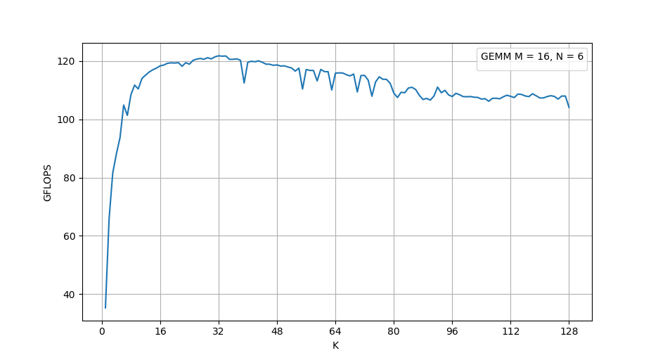

Code Generation & Matrix-Multiplication
=======================================

Task 1: SIMD lanes & Accumulator Block Shapes
---------------------------------------------

The solutions to this first task can be found in `this directory <https://github.com/stefan0re/machine_learning_compiler/tree/main/hello_assembly/assembly_examples/neon>`_.

matmul_14_6_64
______________

For the first task, we have to implement a kernel with :math:`M=14`. This is different to the former implementations, as one column will not fully fill four vector registers. Therefore the loads and stores of the :math:`A` and :math:`C` matrices have to be adjusted. For each vector register we use separate load instructions. For example for the first column of :math:`C`:

.. code-block:: text
    :linenos:

    // load C 
    // load column 1
    ld1 {v0.4s}, [x9]
    add x9, x9, #16
    ld1 {v1.4s}, [x9]
    add x9, x9, #16
    ld1 {v2.4s}, [x9]
    add x9, x9, #16
    ld1 {v3.2s}, [x9]
    add x9, x9, #8

It is important to mind that only half of the last register is used and the pointer is only incremented by 8 bytes.

The throughput test yields the following result:

.. code-block:: text

    Testing matmul_14_6_64 ...
    Iterations:     10000000 times
    Duration:       1.00084 sec
    Throughput:     122.777 GFLOPS

This shows a small decrease, which is explainable through the increase of memory accesses.

matmul_15_6_64
______________

Similarly to :code:`matmul_14_6_64`, we have again columns that do not fully fill 4 vector registers. Additionally, the :code:`LD1` (and :code:`ST1`) instruction does not allow to load (only) 3 single words with one call. Thus, we have to use an additional :code:`LD1` call to load the 15'th element of the column into the third single-precision lane of the fourth vector register in use. This has to be implemented for both :math:`A` and :math:`C`. For example for the first column of :math:`C`:

.. code-block:: text
    :linenos:

    // load C 
    // load column 1
    ld1 {v0.4s}, [x9]
    add x9, x9, #16
    ld1 {v1.4s}, [x9]
    add x9, x9, #16
    ld1 {v2.4s}, [x9]
    add x9, x9, #16
    ld1 {v3.2s}, [x9]
    add x9, x9, #8
    ld1 {v3.s}[2], [X9]
    add x9, x9, #4

Again the pointer has to be increased for another 4 bytes.

The throughput test yields the following result:

.. code-block:: text

    Testing matmul_15_6_64 ...
    Iterations:     10000000 times
    Duration:       1.07793 sec
    Throughput:     113.996 GFLOPS

The throughput is again reduced by additional memory accesses.

matmul_64_64_64
_______________

In this exercise, we have to reshape our kernel, as :math:`N=64\text{ % }6\neq0`. Another restriction is that the whole accumulator block has to fit into the available register. Therefore,  bigger matrix sizes of :math:`16\times16` and :math:`16\times8`, which reduce the amount of memory communication, are not possible. Finally, the next smaller size is :math:`8\times8`, which we chose for our accumulator.

Compared to the implementation for :code:`matmul_64_48_64` we have in total 8 iterations in the :math:`M` loop. Furthermore, each column now only fills two vector registers, which inflates the amount of memory calls.

Our throughput test shows that this has an significant influence on the throughput:

.. code-block:: text

    Testing matmul_64_64_64 ...
    Iterations:     150000 times
    Duration:       1.31555 sec
    Throughput:     59.7796 GFLOPS

Task 2: Generate Function for Microkernel
---------------------------------------------
Each generation function mimics the base ARM assembler instructions. This means the input follows the same format as their assembler equivalents 
and outputs a 32-bit value representing the instruction.

The following example shows the ADD (immediate) instruction, implemented based on the official ARM documentation by setting each part of 
the 32-bit value accordingly:

.. code-block::

    // add  <W/X>d, <W/X>n, #imm12 {, LSL #shift}
    uint32_t InstGen::base_add_imm(gpr_t Wd, gpr_t Wn, int32_t imm12, int32_t shift) {
        uint32_t ins = 0x11000000u;
        ins |= (((Wd >> 5) & 0x1u) << 31);
        ins |= ((shift & 1u) << 22);  // LSL #shift? only 0 or 1
        ins |= (imm12 & 0xFFFu) << 10;
        ins |= ((Wn & 0x1Fu) << 5);
        ins |= (Wd & 0x1Fu);
        return ins;
    }

- The first line, :code:`uint32_t ins = 0x11000000u;`, sets the base 32-bit opcode, with the lower bits initialized to zero.
- The next line, :code:`ins |= (((Wd >> 5) & 0x1u) << 31);`, determines whether the instruction uses 32-bit or 64-bit registers. 
    - The :code:`ins |=` part uses a bitwise OR to incorporate the generated value into the instruction.
    - The expression :code:`<< 31);` shifts the extracted bit to the correct position in the 32-bit instruction format.
    - The :code:`& 0x1u` operation is a bitwise AND used to isolate a specific bit. Similarly, :code:`& 0x1Fu`  is commonly used to keep only the lower five bits of a value.
- Each field—shift, imm12, Wn, and Wd—is processed and encoded into the instruction accordingly.
- In the end, the fully assembled 32-bit instruction is returned.

The following functions are implemented in a similar fashion:

.. code-block::

    // cbnz  <W/X><Rt>, #+imm19
    uint32_t InstGen::base_br_cbnz(gpr_t Rt, int32_t imm19) {
    }

    // ldp  <W/X>t1, <W/X>t2, [<Xn|SP>], #+imm7
    uint32_t InstGen::base_ldp(gpr_t t1, gpr_t t2, gpr_t Xn_SP, uint32_t imm7) {

    // stp  <W/X>t1, <W/X>t2, [<Xn|SP>], #+imm7
    uint32_t InstGen::base_stp(gpr_t t1, gpr_t t2, gpr_t Xn_SP, uint32_t imm7) {
    }

    // mov  <W/X>d, #imm12   (alias of ORR Wd, WZR, #imm12)
    uint32_t InstGen::base_mov_imm(gpr_t Wd, int16_t imm16, uint8_t shift /*= 0*/) {
    }

    // mov  <W/X>d, <W/X>m
    uint32_t InstGen::base_mov_register(gpr_t Wd, gpr_t Wm) {
    }

    // add  <W/X>d, <W/X>n, #imm12 {, LSL #shift}
    uint32_t InstGen::base_add_imm(gpr_t Wd, gpr_t Wn, int32_t imm12, int32_t shift) {
    }

    // add  <W/X>d, <W/X>n, <W/X>m, {LSL|LSR|ASR} #imm6
    uint32_t InstGen::base_add_shifted_register(gpr_t Wd, gpr_t Wn, gpr_t Wm, int32_t shift_type, uint32_t imm6) {
    }

    // sub  <W/X>d, <W/X>n, #imm12 {, LSL #shift}
    uint32_t InstGen::base_sub_imm(gpr_t Wd, gpr_t Wn, int32_t imm12, int32_t shift) {
    }

    // sub  <W/X>d, <W/X>n, <W/X>m, {LSL|LSR|ASR} #imm6
    uint32_t InstGen::base_sub_shifted_register(gpr_t Wd, gpr_t Wn, gpr_t Wm, uint32_t shift_type, uint32_t imm6) {
    }

    // lsl  <W/X>d, <W/X>n, #imm6
    uint32_t InstGen::base_lsl_imm(gpr_t Wd, gpr_t Wn, uint32_t shift) {
    }

    // lsl  <W/X>d, <W/X>n, <W/X>m
    uint32_t InstGen::base_lsl_register(gpr_t Wd, gpr_t Wn, gpr_t Wm) {
    }

    uint32_t InstGen::base_ret() {
    }

    uint32_t InstGen::base_mul_reg(gpr_t dst, gpr_t src_1,gpr_t src_0) {
    }

Task 3: Code Generation
-----------------------

We are finally getting started and preparing the first steps for the machine learning compiler. But to stay low level, we first write a just-in-time compiler for matrix multiplication.
Just-in-time compilation works by generating the code you want to execute at runtime, allowing you to create perfectly tuned assembly code.
The code that makes memory executable and returns a function pointer from it can be seen `here <https://github.com/stefan0re/machine_learning_compiler/tree/main/src/mini_jit/backend>`_.

We started with a very simple variant, a kernel where M = 16 and N = 6 are fixed.
The implementation of this can also be seen on `GitHub <https://github.com/stefan0re/machine_learning_compiler/blob/main/src/mini_jit/generator/Brgemm.cpp>`_.

.. code-block:: C++

    m_kernel.add_instr(inst::InstGen::base_mov_register(inst::InstGen::x7,
                                                        inst::InstGen::x0));
                                

Basically, we call our instruction generator for each instruction that we want to have and write them one after the other into an array. 
You can see this for example in the code above for a :code:`mov x7, x0` instruction.

Our JITer is now able to generate code for matrix multiplication with any K and with free leading dimensions. The performance results can be seen in the plot.

Our tests ran for quite a long time, so we suspect that the results got worse the longer they ran. 
Although the bigger kernels still reached 120 GFLOPS when tested individually.

This week's work is available under this commit on GitHub: b7ce234.

